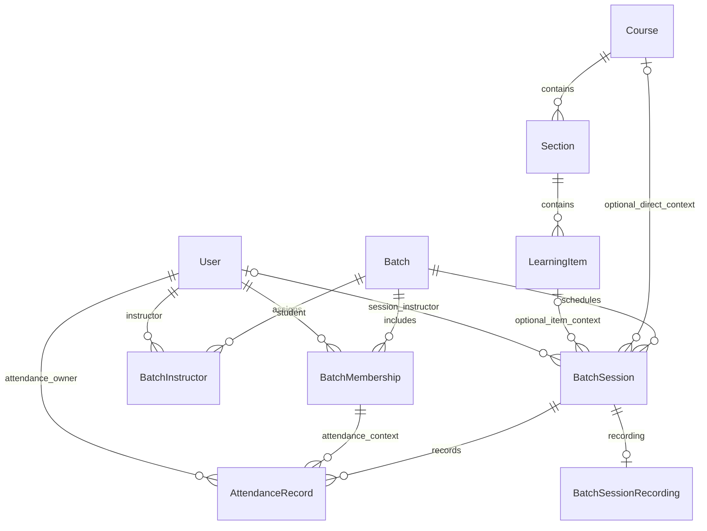

# A1 recording architecture verification

Final owner-approved A1 architecture, implemented locally. Includes the approved exact-Batch historical-or-current membership policy and nullable session-level Instructor. No production migration or deployment.

## A. Exact Prisma proposal

```prisma
enum BatchSessionRecordingStatus {
  UPLOADING
  PROCESSING
  READY
  PUBLISHED
  FAILED
}

model BatchSessionRecording {
  sessionId          String                      @id
  session            BatchSession                @relation(fields: [sessionId], references: [id], onDelete: Restrict, onUpdate: Restrict)
  revision           String                      @unique @default(uuid()) @db.Uuid
  storageProvider    String
  assetRef           String?
  title              String?
  description        String?
  fileName           String?
  mimeType           String?
  bytes              BigInt?
  durationSeconds    Int?
  status             BatchSessionRecordingStatus @default(UPLOADING)
  readyAt            DateTime?                   @db.Timestamptz(6)
  publishedAt        DateTime?                   @db.Timestamptz(6)
  cleanupRequestedAt DateTime?                   @db.Timestamptz(6)
  createdAt          DateTime                     @default(now()) @db.Timestamptz(6)
  updatedAt          DateTime                     @updatedAt @db.Timestamptz(6)

  @@unique([storageProvider, assetRef])
  @@index([status, updatedAt])
  @@index([cleanupRequestedAt])
}
```

Approved additions to the existing BatchSession model:

```prisma
instructorId String?
instructor User? @relation("SessionInstructor", fields: [instructorId], references: [id], onDelete: Restrict, onUpdate: Restrict)
recording BatchSessionRecording?

@@index([instructorId])
```

`sessionId` is both the primary key and foreign key: exactly one recording row per session. No separate row ID, Course ID, User relation, Instructor relation or second learning item is added. The unique provider/reference pair prevents two current session records from claiming the same asset; PostgreSQL permits multiple NULL references while upload initialization is pending. The unique revision supports provider callback correlation. The two ordinary indexes support bounded lifecycle/reconciliation queries and outstanding cleanup queries.

The preliminary `storageKey` becomes the explicit pair `storageProvider` / `assetRef`. `revision`, `readyAt` and `cleanupRequestedAt` are necessary refinements for stale callback rejection, persisted readiness evidence and recoverable asset deletion; they are not a watch-progress model. Optional file metadata accommodates providers that do not expose source byte size or filename. Provider-specific readiness validation remains required.

Prisma cannot express all the needed CHECK constraints. The migration adds checks on the new table only:

- Nonempty storageProvider; nonempty assetRef when non-NULL.
- bytes is NULL or positive; durationSeconds is NULL or nonnegative.
- READY/PUBLISHED requires assetRef and readyAt.
- publishedAt is non-NULL exactly when status is PUBLISHED.
- PUBLISHED requires cleanupRequestedAt to be NULL.

These checks validate stored state; they do not prove an external asset is ready or enforce transition history. The server service must enforce transitions, verify readiness with the adapter, perform version-checked writes, and commit publication/audit atomically. Clients cannot write lifecycle fields or readiness evidence.

## B. Current relationships and the smallest safe context solution



Existing BatchSession relationships:

| Relationship | Exact current behavior                                                                                                                                                                                                                                                                         |
| ------------ | ---------------------------------------------------------------------------------------------------------------------------------------------------------------------------------------------------------------------------------------------------------------------------------------------- |
| Batch        | Required batchId foreign key; deletion restricted; Batch has sessions[]                                                                                                                                                                                                                        |
| Course       | Optional courseId foreign key; deletion restricted; Course has sessions[]                                                                                                                                                                                                                      |
| LearningItem | Optional itemId foreign key; deletion restricted; LearningItem has sessions[]; the FK itself does not restrict type to LIVE_SESSION                                                                                                                                                            |
| Instructor   | Nullable instructorId → User(id), deletion/update RESTRICT; Admin verifies persisted INSTRUCTOR authority and assignment through BatchInstructor for this exact Batch. Existing sessions remain NULL. Changes are audited; removing Batch assignment retains historical session attribution.   |
| Attendance   | attendance[]; each AttendanceRecord has a sessionId/userId composite primary key and membershipId/userId foreign key; the existing attendance_membership_scope SQL trigger enforces matching Batch, owner and membership window on insert/update; staff services add session/date/scope checks |

One LIVE_SESSION item can legitimately have sessions for different Batches or occurrences. Do not make itemId globally unique, select the first session for an item, or infer a Course from a Program's first Course. Playback must identify the particular BatchSession and its recording.

The nullable current links mean some sessions are Batch-only, Course-only or inconsistent. Existing staff attendance code checks LIVE_SESSION type, optional Course agreement and Batch scope for its own operations, but there is no universal database context constraint. That code is not a substitute for recording authorization.

The smallest safe solution uses existing columns. Before publication require:

1. session.itemId exists and refers to a LIVE_SESSION LearningItem.
2. Canonical Course = item.section.courseId.
3. session.courseId is NULL or agrees with that canonical Course. Admin recording/session writes should set it to the same Course for consistency with existing projections.
4. A Course-scoped Batch matches that Course; a Program-scoped Batch matches its Program. If neither scope is set, the explicit item still identifies the Course. Contradictory scope is rejected.
5. The Course, Section and LearningItem are published for student availability.

For an unlinked existing session, Admin must explicitly select an existing LIVE_SESSION item and persist the existing itemId/courseId together, with validation and audit. Draft session metadata may remain unlinked; recording publication cannot. If no appropriate item exists, publication waits for later authoring rather than A1 silently creating one. No new Course/item relationship or backfill is proposed. Rebinding session context while its recording is published must be blocked; unpublish before changing it.

## C. Student authorization path

Clerk session → existing MentoraLM User with STUDENT role → existing LMS entitlement → Enrollment in canonical Course → published Course/Section/LIVE_SESSION item → authorization for the exact session's Batch → PUBLISHED recording, readyAt present and no cleanup request → authorized media delivery.

Every delivery request resolves context server-side and rejects mismatched route Course, item, session or revision. Course/Batch authorization is independent of entitlement: an individual ENABLED override does not grant Enrollment or access to another Batch's recording.

Approved V1 exact-Batch eligibility is an OR: (A) joinedAt ≤ session.startsAt and leftAt is NULL or later than session.startsAt, irrespective of current membership status; or (B) currently ACTIVE membership in that same Batch, with joinedAt ≤ now and leftAt NULL or later than now. A later joiner can catch up on earlier recordings. Membership in another Batch never qualifies. All entitlement, Enrollment and published context gates still apply. AttendanceRecord/PRESENT is not required, and no separate historical Batch-date gate is added to this recording policy.

An adapter returns an authenticated range stream or an expiring, asset-scoped signed delivery token/URL only after these gates. Never return the raw object location or a permanent public playback URL. Direct range streams reauthorize each request; provider tokens expire quickly and future issuance reauthorizes. Already delivered/buffered bytes cannot be recalled, and any issued provider token may remain valid until its bounded expiry unless the provider supports immediate revocation.

Watching a recording performs no AttendanceRecord mutation. ABSENT attendance and later recording viewing remain separate facts. LessonState is tied to Lesson, not LIVE_SESSION; no recording-watch progress persistence is added in A1.

## D. Storage-reference strategy and lifecycle

storageProvider is a server-configured adapter identifier, not a URL, credential or unrestricted user-selected provider. assetRef is that adapter's opaque private asset identity:

- Private object adapter: private object key within its configured bucket/namespace; bucket credentials and endpoint remain server configuration.
- Future streaming adapter: provider asset ID. A playback asset ID/token is resolved by the adapter after authorization, not stored as a permanent delivery URL.

No vendor enum or vendor SDK is required now. Provider implementations must support private delivery, readiness inspection, idempotent creation/cancellation/deletion and reconciliation using the revision correlation token. A provider without recovery for uncertain creation outcomes cannot safely enable uploads. Store no credentials, signed URLs, public video URLs or binary video in this table. bytes is a byte count only.

No row = NO_RECORDING.

Normal lifecycle: UPLOADING → PROCESSING → READY → PUBLISHED. Failure transitions to FAILED; unpublish transitions PUBLISHED → READY and clears publishedAt. READY/PUBLISHED requires storage-confirmed readiness, recorded in readyAt. Admin cannot publish PROCESSING/UPLOADING/FAILED or manufacture readyAt. Publication must start from READY and recheck adapter availability.

UPLOADING is persisted before external initialization: it reserves the single session slot, supplies the revision/idempotency correlation and makes interrupted/abandoned uploads recoverable. The assetRef may be NULL until a provider acknowledges its asset identity. Provider-created objects/reservations must be tagged/correlated with revision so reconciliation can find them if the process fails before saving their reference. Timeouts, cleanup and late callbacks use that same revision. This is why a purely browser-local UPLOADING state is insufficient for the proposed managed upload workflow.

With no configured large-video provider, initiation remains unavailable: no fake READY records, unsafe local video upload or invented processing progress. PostgreSQL contains metadata/references only.

## E. V1 replacement/deletion strategy

Exactly one recording row and therefore at most one published recording per BatchSession. V1 does not stage a second replacement while keeping the old recording published. Replacement deliberately makes the recording temporarily unavailable; this limitation must be clear in the Admin confirmation.

1. Authorized Admin requests deletion/replacement with the expected revision. Lock/version-check the row, clear publication, persist cleanupRequestedAt, and append an audit intent in one transaction. Existing delivery endpoints stop issuing playback immediately.
2. Keep the row and its provider reference until the adapter confirms deletion/cancellation of the old private asset and any upload reservation. Stop further processing/publication. Cleanup is idempotent and reconciles by revision, including the NULL-reference initialization window.
3. If cleanup fails or its outcome is uncertain, retain the unpublished row and durable cleanup marker. Show cleanup pending/failed; retry/reconcile. Do not hard-delete the row or begin the replacement while the old asset's outcome is unknown.
4. After confirmed asset absence, transactionally delete the recording row and append cleanup completion audit. Session/Attendance records remain. No row now means NO_RECORDING. The session FK restriction prevents parent deletion while a recording still exists.
5. For replacement, create a fresh row with a new revision, use a new asset identity, and run the full upload/readiness/publication workflow. Do not overwrite an old object key or reuse its delivery identity. Old callbacks must match the old revision and are rejected; there is no fallback or ambiguous playback.

AcademicAudit survives recording deletion because it stores its target identifier and concise before/after details without a recording foreign key. Record initiator, operation, session/revision, state transitions and opaque provider reference where needed for reconciliation; never store signed URLs, secrets or large content bodies. External storage deletion cannot share a PostgreSQL transaction, so the durable intent/confirmation protocol is required. Production must provide a reconciliation/retry runner or an explicit operational retry workflow before uploads are enabled; lifecycle expiry for abandoned multipart/upload reservations is additional protection, not the only cleanup mechanism.

Published links resolve the current session recording and revision each time. After unpublish, new issuance is denied; existing signed token/cache validity is bounded by the configured delivery policy. Replacement never redirects an old asset token to the new recording. No recording-watch state needs deletion or migration in A1 because none is introduced.

## F. Exact additive migration impact

- Add BatchSessionRecordingStatus enum.
- Add BatchSessionRecording metadata table with the fields above.
- Add sessionId primary key and restricted foreign key to BatchSession(id).
- Add revision unique constraint and storageProvider/assetRef composite unique constraint.
- Add status/updatedAt and cleanupRequestedAt indexes.
- Add the five new-table CHECK invariants described in A.
- Add the Prisma inverse recording relation to BatchSession (no database column).
- Add nullable BatchSession.instructorId TEXT, restricted foreign key to User(id), and instructorId index; User.taughtSessions is its Prisma inverse. No backfill.
- No changes to User, StudentProfile, Enrollment, Batch, BatchMembership, BatchInstructor, Course, Section, LearningItem, LessonState, AttendanceRecord or AcademicAudit data/columns.
- No backfill, role promotion, mandatory context changes to existing sessions, data rewrite, watch-progress table or binary storage.

Applied only to loopback mentoralm_dev/public and disposable isolated schemas in mentoralm_test. No production connection or deployment is authorized. Existing sessions initially have no recording row. A later rollback must not drop recorded metadata/assets without explicit disposal; forward repair is preferred once recordings exist.

Validation: clean migration, populated seven-migration upgrade, CHECK/foreign-key constraints and preservation tests passed. A1 lifecycle/access/concurrency tests and relevant L4 regression tests passed. Full validation and browser results are recorded in ADMIN-A1.md.

Adapter cancellation/deletion must fence late creation by revision: once remove confirms absence, begin may not subsequently create an asset for that revision. Creation must be idempotent, immutable once ready, and discoverable by revision even before assetRef is saved. A background runner must inspect UPLOADING/PROCESSING and cleanupRequestedAt records, reconcile uncertain operations, and recover expired reservations. These are required integration contracts; no provider or background worker is installed in A1.
